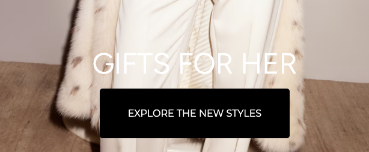

# Procesverslag
Markdown is een simpele manier om HTML te schrijven.  
Markdown cheat cheet: [Hulp bij het schrijven van Markdown](https://github.com/adam-p/markdown-here/wiki/Markdown-Cheatsheet).

Nb. De standaardstructuur en de spartaanse opmaak van de README.md zijn helemaal prima. Het gaat om de inhoud van je procesverslag. Besteedt de tijd voor pracht en praal aan je website.

Nb. Door *open* toe te voegen aan een *details* element kun je deze standaard open zetten. Fijn om dat steeds voor de relevante stuk(ken) te doen.

## Jij

  
uitwerken voor kick-off werkgroep

  ### Auteur:
  Niels van Uden

  #### Je startniveau:
  Blauw

  #### Je focus:
  Surface plane

## Je website

  
uitwerken voor kick-off werkgroep

  ### Je opdracht:
  https://www.gucci.com/nl/en_gb/

  #### Screenshot(s) van de eerste pagina (small screen): 
  Gucci Homepage  
  
  

  #### Screenshot(s) van de tweede pagina (small screen):
  Gucci Productpagina  
  
 

## Toegankelijkheidstest 1/2 (week 1)

  
uitwerken na test in 2e werkgroep

  ### Bevindingen
  Jim deed er 1 minuut en 18 seconden over om een jas aan zijn winkelmandje toe te voegen terwijl hij een ballon in de lucht hield met zijn hand. Vervolgens ging hij de test doen zonder ballon, en was het binnen 25 seconden gelukt. Met ballon duurde het dus 53 seconden langer.

  Met de voiceover op de website van gucci, zitten er allemaal letters/woorden verstopt achter de afbeelding die hij 1 voor 1 voorleest.

  Gucci website gaat heel slecht, hij leest wel de alt tekst van afbeeldingen op, maar soms doet hij het woord per woord of soms letter per letter. Bij mijn klasgenoot zijn screenreader leest ‘ie het wel goed op.

  Op budweiser worden de links wel aangegeven, maar ze zeggen niet waar het naartoe gaat. De social buttons geven niet aan naar welk social media platform het gaat. Dit is erg verwarrend.

## Breakdownschets (week 1)

  
uitwerken na afloop 3e werkgroep

  ### de hele pagina: 
  

  ### dynamisch deel (bijv menu): 
  

## Voortgang 1 (week 2)

  
uitwerken voor 1e voortgang

  ### Stand van zaken
  In week twee ben ik nog niet heel veel met mijn code bezig geweest, ik heb toen voornamelijk focus gelegd op het afmaken van mijn html. Aan CSS ben ik nog niet veel toegekomen, ik had alleen geen idee hoe ik afbeeldingen onder mijn tekst kreeg etc. Dit heb ik uiteindelijk op weten te lossen met position absolute en relative. 

  ### Agenda voor meeting
  - Hoe kan ik mijn tweede pagina anders stijlen dan mijn eerste pagina?

  ### Verslag van meeting
  - Ik mag div's en classes gebruiken voor styling purposes als het echt niet anders kan. Als ik op de tweede pagina dus grid wil gebruiken en op de eerste pagina niet. Kan ik een div maken en daar omheen een class om hem zo aan te spreken in de CSS.

## Voortgang 2 (week 3)

  
uitwerken voor 2e voortgang

  ### Stand van zaken
  Het begin met css ging iets beter dan verwacht. Het stylen van de homepagina ging redelijk goed, ik ben nog niet echt toegekomen aan mijn tweede pagina maar ik weet wel al hoe ik dit aan ga pakken. Ik heb net ontdekt dat ik geen afbeeldingen hoef te gebruiken voor de icoontjes bovenin maar dat je gewoon svg icons kan downloaden en als lapje tekst aan je code kan toevoegen. Zo kan je het ook nog makkelijk customizen en positioneren. De website begint er nu wel een stuk leuker uit te zien. Met position absolute en relative is het moeilijk om mijn a's en h2's in het midden te krijgen van de afbeelding. Dat is nu mijn grootste vraag voor het feedback gesprek.

  ### Agenda voor meeting
  
  - Hoe centreer ik de a's en h2's over mijn afbeelding heen?

  ### Verslag van meeting
    De tekst in het midden krijgen ging erg lastig, de studentassistenten hielpen mij uiteindelijk met translate x etc. Ik begreep hier zelf weinig van en kreeg het niet helemaal in het midden. Dus dit heb ik naderhand nog opgelost met left & right.

## Toegankelijkheidstest 2/2 (week 4)

  
uitwerken na test in 9e werkgroep

  ### Bevindingen
  Ik ben met de screenreader over mijn website heen geweest, en er zijn nog wel een paar dingen die ik moet fixen:

  - De volledige navigatie leest hij als banner (wellicht alttext toevoegen aan svg icons (update: geen alttext maar aria-label))
  - Linkjes toevoegen aan alle list items en svg's
  - Heading levels kloppen niet, gaat van h2 naar h4, dit even aanpassen.

  Voor de rest is vooralsnog alles in orde, de website is bijna af en dan ga ik er nog een keer doorheen om te checken of het klopt. Hij is in ieder geval beter dan van gucci zelf, want daar ging van alles mis en zat er tekst achter de afbeeldingen en gebruikten zij geen headings etc.

## Voortgang 3 (week 4)

  
uitwerken voor 3e voortgang

  ### Stand van zaken
  Het gaat inmiddels een stuk beter met alles, de meeste dingen die ik probeer werken wel ipv dat het niet werkt. Het is wel lastig om de pagina's apart van elkaar te stijlen maar het lukt aardig. Er zijn wel een paar dingetjes waar ik nu tegen aanloop en de tijd begint wel te dringen. Ik wil namelijk een horizontale scrollbare lijst aan items maken van 3 items. 2 videos en 1 img. Hier kom ik niet helemaal uit. En ik weet niet hoe ik mijn hamburger menu werkend krijg. Ik wil ook mijn h1 werkend krijgen als link en dit lukt niet helemaal.

  ### Agenda voor meeting
 
  - Horizontal scroll?
  - Hamburger menu?
  - h1 als link?
  - Wanneer button wanneer link?

  ### Verslag van meeting
  
  - De horizontale scroll is opgelost met overflow-x. De items heb ik display flex gegeven zodat ze naast elkaar staan en nu lopen ze niet meer over de hele pagina maar zijn ze achter de border verstopt. Hamburger menu heb ik niet kunnen fixen maar daar wil een klasgenoot mij mee helpen (update: hamburger menu is gelukt). h1 als link heb ik opgelost door de link IN de h1 te zetten, en niet de h1 in de link... Ik had op sommige plekken links en buttons verkeerd gebruikt, maar nu weet ik dat ik alleen een button moet gebruiken als het ook iets uitvoert zoals een 'load more'. En een link is juist als het je naar een andere pagina brengt.

## Eindgesprek (week 5)

  
uitwerken voor eindgesprek

  ### Je uitkomst - karakteristiek screenshots:
  
  

  ### Dit ging goed/Heb ik geleerd: 
  Korte omschrijving met plaatjes

  
  Iets wat ik voor dit vak nog niet helemaal begreep was flexbox, maar dat is in deze afbeelding een voorbeeld dat het mij nu wel lukt. Gewoon twee afbeeldingen naast elkaar krijgen die niet dezelfde breedte hebben.

  
  Ik kreeg eerst de afbeeldingen wel naast elkaar maar niet scrollbaar, maar dit kan ik nu makkelijk oplossen met overflow-x. Zo blijven ze binnen het scherm zonder dat de hele website in z'n geheel naar rechts gaat als je scrollt.

  
  Ik weet nu eindelijk hoe ik dingen over elkaar heen kan stacken qua afbeeldingen/tekst en positioneren. Door het main item position relative te geven en de items daarboven position absolute kan ik het makkelijk mooi krijgen.

  
  Normaal gesproken pakte ik altijd afbeeldingen als icons voor mijn header, maar tijdens FED ben ik er achtergekomen dat je gewoon svgicons makkelijk kan downloaden en in css makkelijk kan vormgeven qua kleur en lijndikte etc. Dat heb ik dus voor dit project gedaan en heb ik daardoor ook leuke dingetjes ermee kunnen doen door er een hover overheen te zetten etc.

  ### Dit was lastig/Is niet gelukt:

  
  Wat mij helaas niet is gelukt is deze scrollbar automatisch infinite laten lopen, ik heb van alles geprobeerd en hulp gevraagd aan docenten en chatgpt maar het is helaas niet gelukt. Maar hij is nu wel scrollbaar en ziet er alsnog leuk uit.

## Bronnenlijst

  
continu bijhouden terwijl je werkt

Voor deze opdracht heb ik naast hulp van leraren, studentassistenten en klasgenoten alleen ChatGPT gebruikt voor hulp, dus als bij alle onderstaande bronnen staat ChatGPT vast als bronvermelding. Ik voeg het prompt toe wat ik (deels) heb gebruikt.

  1. Q: I want the li items in the ul in the main to be next to eachother, in a bar that just keeps automatically scrolling in the screen.
        But i have no idea how to style this. (Ik heb dit uiteindelijk niet gebruikt, want het deed niet helemaal wat ik wilde en heb dit later opgelost met Vasilis voor zover ik kon)

     A: /* Add this CSS for the horizontal scrolling bar */
main ul {
  white-space: nowrap; /* Prevent wrapping to the next line */
  overflow-x: auto;    /* Enable horizontal scrolling */
  -webkit-overflow-scrolling: touch; /* Smooth scrolling on iOS */
}

main li {
  display: inline-block; /* Display list items in a row */
  margin-right: 10px;    /* Add some space between list items */
}

/* Optional: Add a max-width to limit the width of the scrolling container */
main ul {
  max-width: 100%; /* Adjust as needed */
}

  2. Q: I want the 
E-mail
 bar to be a typeable bar, so people can fill out their email, how can i do this?
     A: Instead of 
E-mail
, use the following <input> tag
  < input type="email" placeholder="E-mail" > 

  3. Q: i want the svg hearts to fill up when i hover over them.
     A: .heart {
  fill: none;
  stroke: #ff0000; /* Stroke color */
  stroke-width: 3; /* Adjust the stroke width as needed */
  transition: fill 0.3s ease; /* Add a smooth transition effect for the fill */
}

/* Fill the heart on hover */
.heart:hover {
  fill: #ff0000; /* Fill color */
  stroke: none; /* Remove the stroke on hover, or adjust as needed */
}

  4. Q: I want my h1 a to change color with keyframes when you hover over it, how do i make this work? (achteraf wisselend font gebruikt ipv kleuren)
     A: @keyframes colorChange {
  0% { color: initial; } /* Initial color or the default color */
  50% { color: #ff0000; } /* Midpoint color */
  100% { color: #00ff00; } /* Final color */
}

h1 {
  animation: colorChange 2s infinite; /* Adjust duration and other properties as needed */
}

h1:hover {
  animation: none; /* Disable the animation on hover */
  color: #0000ff; /* Change the color directly */
}

  5. Q: how to i make an img rotate in css on the x axis
     A: .rotate-x {
  transform: rotateX(45deg); /* Adjust the angle as needed */
}

  6. Q: how do i add light and darkmode in my html and css without using javascript, i used clear colors in my root.
     A: @media (prefers-color-scheme: dark) {
    body {
        background-color: var(--background-color-dark);
        color: var(--text-color-dark);
    }

  7. iconsvg.xyz voor alle icons in mijn website, zelf verder gecustomized.
  8. Gucci.com voor alle afbeeldingen in mijn website.

